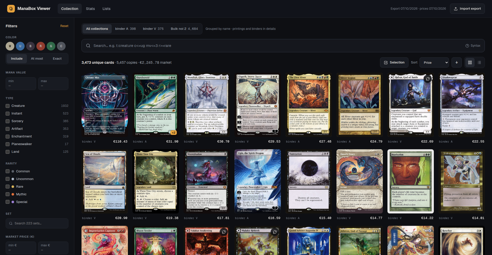
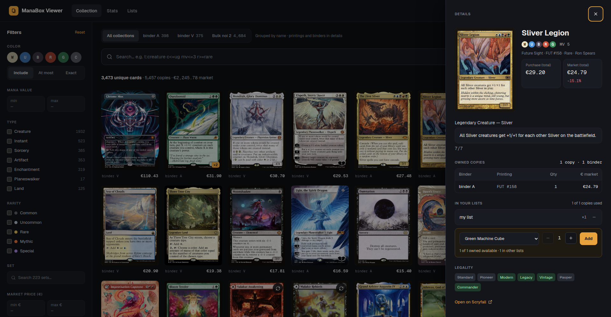
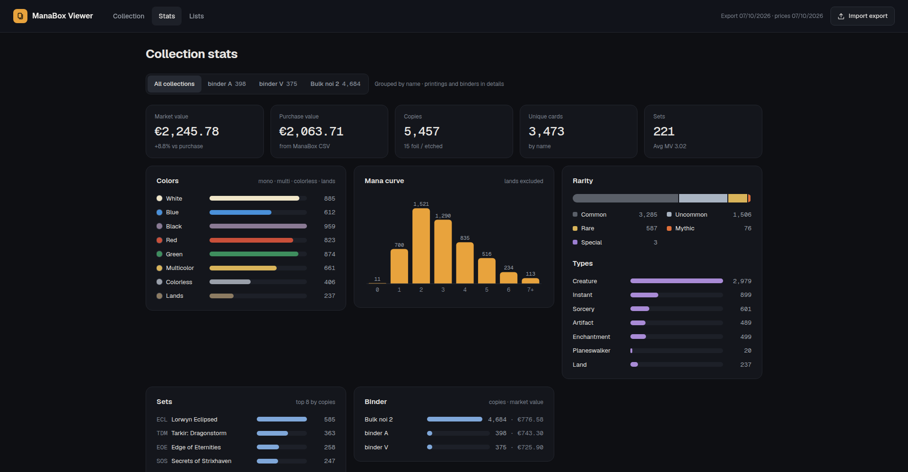
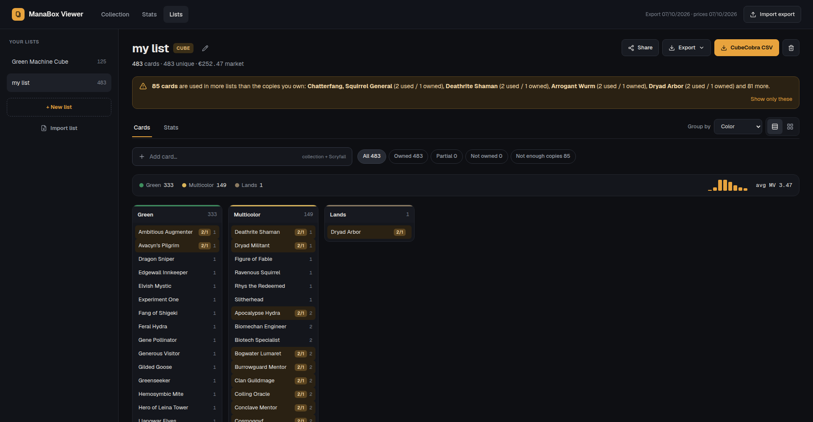
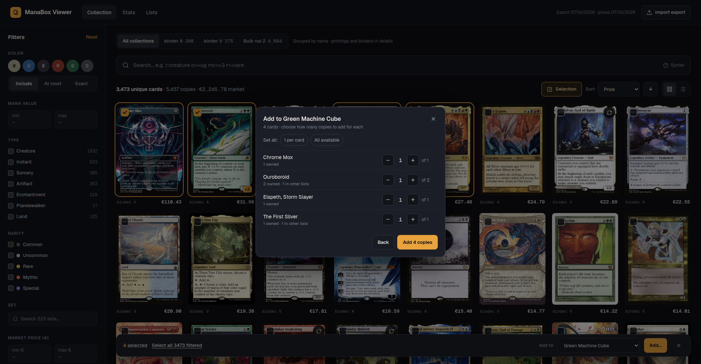
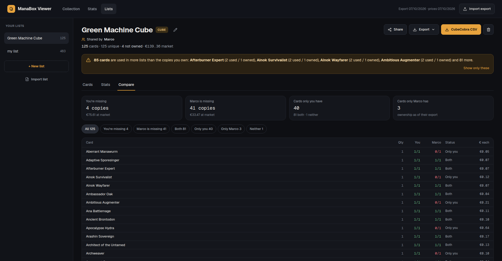

# ManaBox Viewer

A local web app to browse your [ManaBox](https://manabox.app) collection from a computer. You can search it with Scryfall syntax, look at card images and stats, and build lists and cubes to export to [CubeCobra](https://cubecobra.com) or share with friends.



ManaBox's CSV export only has ownership data: name, set, number, binder, quantity and purchase price. ManaBox Viewer fills in the rest from Scryfall (mana cost, types, oracle text, colors, prices, images) and keeps it in a local cache.

## Quick start

You only need Docker.

```bash
docker compose up -d --build   # http://localhost:8080
docker compose down            # stop
```

- **Different port:** `PORT=9000 docker compose up -d`.
- **Where data lives:** everything is in `./data`, which survives restarts and rebuilds. That includes the SQLite database, the Scryfall card cache and the downloaded images.
- **First run:** the app asks for your CSV. In ManaBox, go to *Collection → ⋯ → Export → CSV*.
- **What the import costs:** card data is fetched in batches of 75. About 3,500 cards take around 50 requests, spaced 200 ms apart. Images are downloaded and cached the first time they are shown.

## Features

### Collection
- **Two views:** *All collections* groups every printing and binder by card name, while a single binder shows one tile per row of the export.
- **Layout:** a grid or a table, both virtualised so thousands of cards stay smooth.
- **Card preview:** hovering shows a large version of the card (both faces for double-faced cards), and the flip button turns the tile over.
- **Card detail:** oracle text, purchase vs market price, the copies you own per binder and printing, and the lists the card is in.



### Search
Search uses Scryfall syntax, combined with a filter panel for color, mana value, type, rarity, set, binder, price and finish. Everything lives in the URL, so searches can be bookmarked. Examples:

| Query | Meaning |
|---|---|
| `c<=ub t:instant mv<=2` | cheap blue/black instants |
| `o:"draw a card" -t:creature` | non-creature card draw |
| `r>=rare f:pauper` | pauper-legal rares and up |
| `id:azorius is:commander` | Azorius commanders |
| `eur>=5 binder:"binder A"` | valuable cards in one binder |
| `(t:goblin OR t:elf) pow>=2` | grouping with `OR` and parentheses |

The **Syntax** button in the search bar lists every supported key: `c`, `id`, `t`, `o`, `mv`, `m`, `pow`, `tou`, `loy`, `r`, `s`, `cn`, `a`, `kw`, `is:`, `f`, `eur`, `buy`, `qty`, `binder`, `lang` and `year`.

### Stats
Stats cover market and purchase value, colors, mana curve, rarity, types, sets, binders and your most valuable cards. You can see them for the whole collection, a single binder or any list.



### Lists and cubes
- **Adding cards:** add them one at a time, or select several (click, shift-click for a range, or *Select all N filtered*). For each card you choose how many copies, e.g. "I own 3, put 2 in the cube".
- **Cards by name, not printing:** lists track cards by name, so they stay linked to your collection across new imports.
- **Cards you don't own:** you can add them from a Scryfall search. They are shown dimmed and flagged *Not owned*, or *1/2* when you own fewer copies than the list needs.
- **Overuse warning:** you are warned when a card is used in more lists than the copies you own.
- **List views:** cube-style columns by color, type, mana value, rarity or tag; an image view; and per-list stats. Each group header shows how many copies you own and what the missing ones cost.
- **Tags:** label cards with any tags (CubeCobra's *tags*), filter the list by tag and group by it. Tags travel with the CubeCobra CSV and the *Share* file.
- **CubeCobra sync:** import a public cube from its URL (*Import list*) or link an existing list to one (*Export → Link to CubeCobra cube…*), then see right away which cards you're missing. **Sync** shows what changed on CubeCobra (cards added, removed, new tags) before applying it; the cube decides the cards, while its tags are added to yours (tags removed on CubeCobra are kept locally; a card holds at most 20 tags). A sync that would find no recognisable cards in the cube is refused, so it can't empty the list.
- **You vs CubeCobra:** a linked cube gets a **Compare** tab that sets your collection against what CubeCobra marks as owned (owned, proxied or borrowed count the same): cards you own but CubeCobra doesn't know yet, cards marked owned on CubeCobra but missing from your collection, and so on.
- **Owned status on export:** the CubeCobra CSV marks the copies in your collection as *Owned* (keeping *Premium Owned*); the other copies keep their CubeCobra status (*Proxied*, *Ordered*, *Borrowed*...) or are *Not Owned*. Re-uploading it brings CubeCobra up to date with your collection.
- **Exports:**
  - **CubeCobra CSV** with tags, for *Replace with CSV file upload*;
  - plain **`.txt`** (`1 Name (SET) 123`);
  - a **missing cards** `.txt` you can use as a shopping list.





### Sharing lists
**Share** exports a list in the ManaBox Viewer format: a plain `.txt` that also records how many copies *you* own of each card.

```
# ManaBox Viewer list v1
# name: Pauper Cube
# kind: cube
# exported: 2026-10-07
2 Lightning Bolt (2X2) 117 | owned 1 | tags: Burn; Aggro
1 Counterspell (MH2) 267 | owned 0
```

Anything after `|` is ignored by other tools, so the file still works wherever `1 Name (SET) 123` lists are accepted.

**Import list** (on the Lists page) accepts a share file or any plain `.txt` list, either uploaded or pasted.
- **Before saving**, it shows how the list compares with your collection: owned, partial and missing cards, plus the cost to complete.
- **Shared ownership:** when the file comes from another ManaBox Viewer user, the list gets a **Compare** tab showing who has what: *both*, *only you*, *only them* and *neither*, and the copies and value each of you is missing. It's handy for deciding who brings which cards to a shared cube, or what to trade.



### New exports
Importing a new CSV replaces the previous one. You get a summary of the changes (cards added, removed, and quantity changes), and lists update their ownership automatically.

## Prices

Market prices come from Scryfall in EUR, using foil prices for foils. Cards without a EUR price use the USD price converted at `USD_TO_EUR`, set in `docker-compose.yml` (default 0.92). Purchase prices come from the ManaBox CSV. To fetch today's prices, use *Refresh prices* on the Import page.

## Development

```bash
# backend (port 8765)
cd backend && python3 -m venv .venv && .venv/bin/pip install -r requirements-dev.txt
DATA_DIR=../data .venv/bin/uvicorn app.main:app --reload --port 8765
.venv/bin/python -m pytest

# frontend (port 5173, proxies /api to 8765)
cd frontend && npm install && npm run dev
npx vitest run
```

**Stack:** FastAPI + SQLite on the backend; React 19 + Vite + TypeScript + Tailwind CSS v4 on the frontend. Filtering, sorting and stats run in the browser, and the backend handles imports, the Scryfall cache, images and lists. The Docker image is a multi-stage build that serves the built frontend from FastAPI.

Card data and images are provided by [Scryfall](https://scryfall.com). ManaBox Viewer is not affiliated with ManaBox, Scryfall, CubeCobra or Wizards of the Coast.
